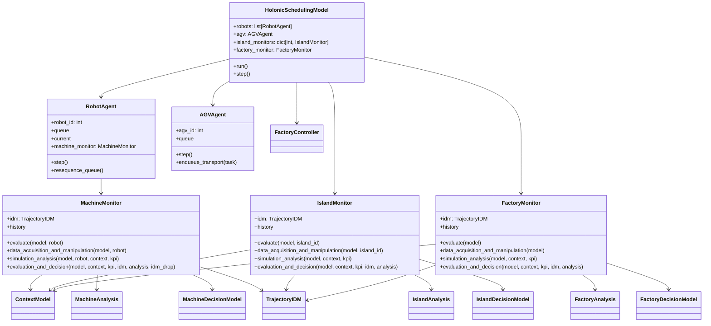

# Monitoring Agent Demo for CPPS

This repository contains a small holonic production simulation with three monitor levels:

- `MachineMonitor`
- `IslandMonitor`
- `FactoryMonitor`

The structure follows the paper's monitoring pattern:

- `Data Acquisition & Manipulation`
- `Simulation / Analysis`
- `Evaluation & Decision`
- `Context`, `Analysis`, and `Decision` model separation

## Project Layout

```text
.
|-- main.py
|-- model.py
|-- agents.py
|-- factory.py
|-- orders.py
|-- buffers.py
|-- monitoring_agent/
|   |-- __init__.py
|   |-- agents.py
|   |-- descriptive_models.py
|   |-- inference_models.py
|   |-- decision_models.py
|   `-- kpis.py
`-- README.md
```

## Code Mapping

- `monitoring_agent/descriptive_models.py`
  Builds contextual views for machine, island, and factory level.
- `monitoring_agent/inference_models.py`
  Holds IDM logic, deviation analysis, and short-horizon forecasts.
- `monitoring_agent/decision_models.py`
  Holds intervention logic.
- `monitoring_agent/agents.py`
  Holds the actual monitor classes.
- `agents.py`
  Simulated resources and transport agents.
- `model.py`
  Runs the production system and wires the monitor hierarchy together.

## Class Diagram



## Monitoring Levels

`MachineMonitor` evaluates local KPIs such as utilization, waiting time, queue length, delay, availability, and IDM.

`IslandMonitor` aggregates machine state into throughput, backlog, tardiness, workload imbalance, availability, and IDM.

`FactoryMonitor` aggregates global production state and produces system-level monitoring outputs and replanning hints.

## Naming

The monitoring layer now consistently uses:

- `machine`
- `island`
- `factory`
- `monitor`

The simulation still keeps `station_id` for physical routing. In practice, that station is treated as the island monitored by `IslandMonitor`.

## Running

Install dependencies:

```powershell
.\venv\Scripts\python.exe -m pip install -r requirements.txt
```

Full sweep:

```powershell
.\venv\Scripts\python.exe main.py
```

Small demo run:

```powershell
.\venv\Scripts\python.exe -c "from main import run_demo; run_demo(seed=42, n_orders=4, max_steps=60, save_aux_outputs=False)"
```

## Outputs

The demo can generate:

- `idm_plot.pdf`
- `idm_plot.svg`
- `gantt_planned.png`
- `gantt_actual.png`
- `gantt_island_planned.png`
- `gantt_island_actual.png`
- `kpi_factory.png`
- `kpi_robots.png`
- `order_hierarchy.json`
- `sim_step_log.jsonl`
- `idm_sweep/summary.csv`
